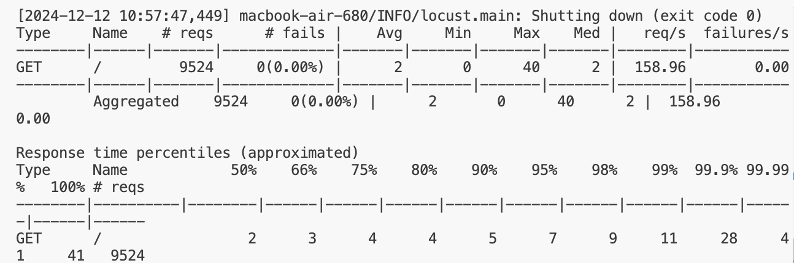
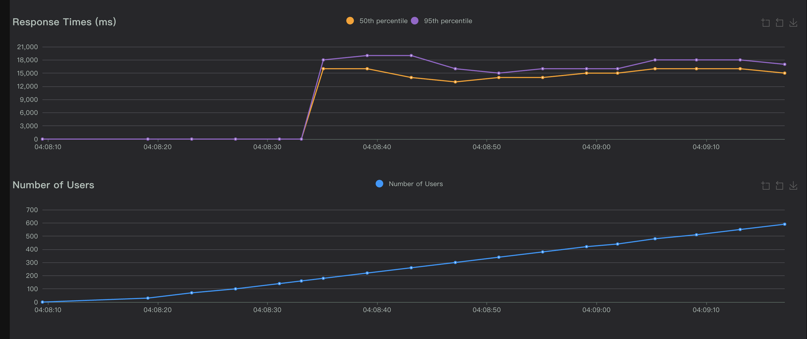
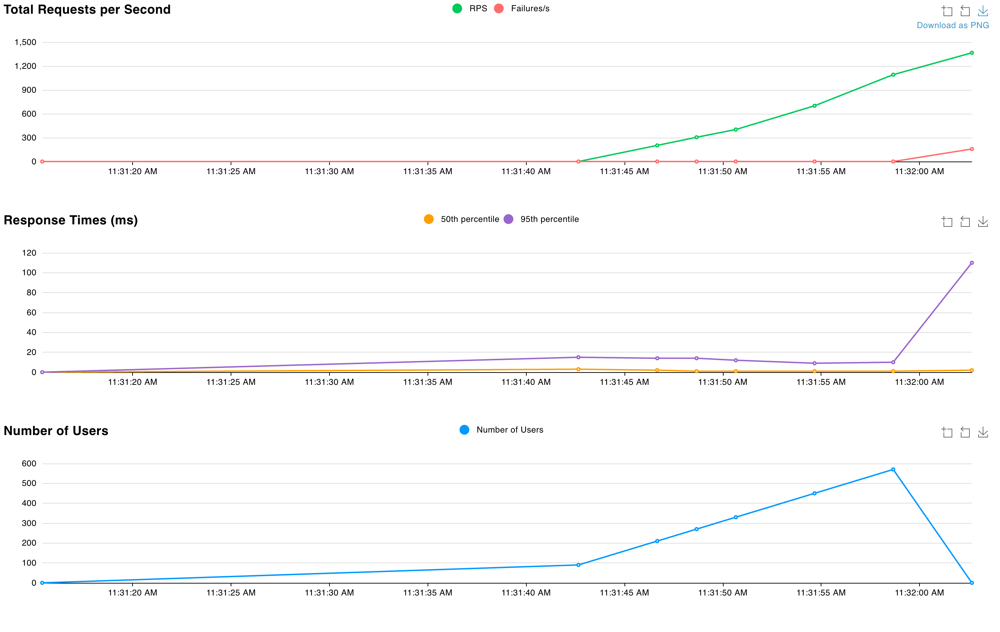
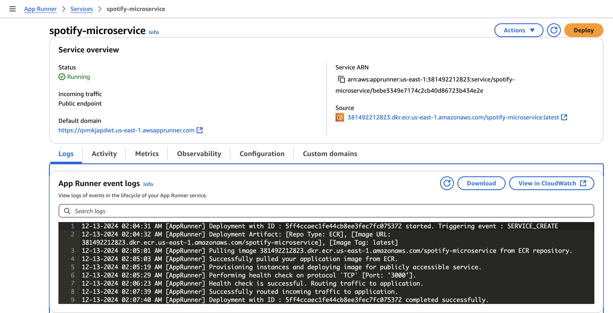

[](https://github.com/aoaow/spotify_microservice/actions/workflows/actions.yml)
[](https://github.com/aoaow/spotify_microservice/actions/workflows/format.yml)
[](https://github.com/aoaow/spotify_microservice/actions/workflows/install.yml)
[](https://github.com/aoaow/spotify_microservice/actions/workflows/lint.yml)
[](https://github.com/aoaow/spotify_microservice/actions/workflows/test.yml)
# IDS706 - Final Project - Spotify Microservice

## Microservice and Core Development Documentation

## Video presentation
Watch the video presentation [here](https://youtu.be/KZIzitQN4ss) 

### Summary of Completed Work:

**1. Core Microservice Implementation**
- **Technology**: Python (Flask framework).
- **Endpoints**:
  - `/rankings`: Fetch top-ranked tracks by region and date.
  - `/artist`: Retrieve track data for a specific artist.
- **Optimizations**:
  - Cached grouped data for faster query performance.
  - Optimized database filtering and ranking logic.
- **Tested Functionality**:
  - Successfully tested all endpoints locally, within a Docker container, and deployed to AWS App Runner.

**2. Logging**
- Integrated structured logging to track:
  - Incoming requests (parameters, endpoints).
  - Errors and debug information.
- Logs are written to both the console and a file (`app.log`).
- Verified correctness during various test scenarios.

**3. Dockerization**
- Created a production-ready Dockerfile:
  - Uses `gunicorn` as a WSGI server for performance.
  - Handles dependency installation (`requirements.txt`).
  - Exposes port 3000 for microservice access.
- Verified the Docker image works as expected locally and pushed the image to AWS ECR.

⚠️ **Note: When to Rebuild the Docker Image?**
- If any of the following files are updated:
    - `app.py` (microservice logic).
    - `requirements.txt` (dependencies).
    - `Dockerfile` (image configuration).
    - Dataset file (e.g., `spotify_top_200.parquet`) if it is embedded within the image.
- Rebuild the Docker image with:
    ```bash
    docker build -t spotify_microservice .
    ```
- After rebuilding, test the new image by running:
    ```bash
    docker run -p 3000:3000 spotify_microservice
    ```

**4. Deployment to AWS App Runner**
- Pushed the Docker image to AWS ECR.
- Deployed the microservice using AWS App Runner:
  - Configured the service to pull the image from ECR.
  - Verified successful deployment and health checks.
  - Public endpoint available for accessing the service.




---

### Load Test



- Performance under Load: The system handles initial load increases well, but begins to struggle as the number of requests per second and concurrent users grow drastically. 
- Potential Issues: The spike in response times and growing failures suggest bottlenecks, possibly in CPU, memory, or I/O capacity. 
-	Next Steps: Investigate system resource utilization during this test and identify the bottleneck. Consider optimizing code, scaling infrastructure, or implementing load-balancing techniques to improve system performance. The switch to AWS EC2 does not aid the situation. Due to budget limit, we might try to move our database to AWS Postgre SQL to enable transcational query optimization.

---

### Files and Their Purposes
1. `app.py`: The Flask microservice implementation.
2. `locustfile.py`: Load testing script for simulating requests.
3. `Dockerfile`: Defines the Docker image for production deployment.
4. `requirements.txt`: Python dependencies for the microservice.
5. `data.py`: Script for preparing and transforming the dataset.
6. `spotify_top_200.parquet`: Preprocessed dataset for use in the microservice.

---

### How to Test Locally

1. **Run the microservice**:
   - Open a terminal and run:
     ```bash
     python app.py
     ```
   - This starts the Flask application. Access endpoints at `http://127.0.0.1:3000`.

2. **Run load tests**:
   - Open a **second terminal** and run:
     ```bash
     locust -f locustfile.py
     ```
   - This starts the Locust load testing framework. Access the monitoring interface at `http://127.0.0.1:8089`.

   **Note**: Ensure both `app.py` and `locustfile.py` are running simultaneously to avoid interruptions.

3. **Run the Docker container**:
   - Alternatively, test the Dockerized version:
     ```bash
     docker run -p 3000:3000 spotify_microservice
     ```
   - Access the application at `http://127.0.0.1:3000`.

4. **Rebuild the Docker Image** (if required):
   - If you modify any code or configuration:
     ```bash
     docker build -t spotify_microservice .
     ```
   - Test the updated image using the steps above.

---

## Infrastructure as Code

This project uses AWS App Runner for deployment, pulling Docker images from AWS ECR and managing the infrastructure automatically. Health checks and scaling configurations ensure smooth operation under varying loads.




---
## Architectural Diagram


### Final Repository Link
[Spotify Microservice GitHub Repository](https://github.com/nogibjj/IDS706_Final_Spotify_Microservice)
